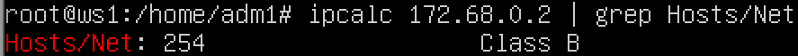
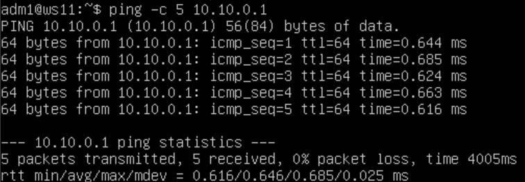
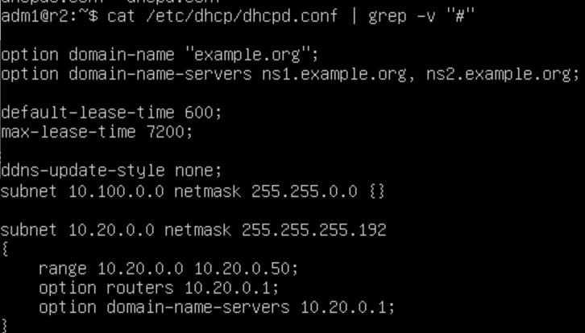

# Contents

1. [Part I ipcalc tool](#part-1-ipcalc-tool)
2. [Part II Static routing between two machines](#part-2-static-routing-between-two-machines)
3. [Part III iperf3 utility](#part-3-iperf3-utility)
4. [Part IV Network firewall](#part-4-network-firewall)
5. [Part V Static network routing](#part-5-static-network-routing)
6. [Part VI Dynamic IP configuration using DHCP](#part-6-dynamic-ip-configuration-using-dhcp)
7. [Part VII NAT](#part-7-nat)
8. [Part VIII Bonus. Introduction to SSH Tunnels](#part-8-bonus-introduction-to-ssh-tunnels)

## Part 1. **ipcalc** tool

1. Networks and Masks
    - Network address of *192.167.38.54/13*
        
    - Conversion of the mask
        - *255.255.255.0* to prefix and binary \
            
        - */15* to normal and binary \
            
        - *11111111.11111111.11111111.11110000* to normal and prefix \
            
    - Minimum and maximum host in *12.167.38.4* network with masks:
        - */8* \
            
        - */11111111.11111111.00000000.00000000* \
            
        - */255.255.254.0* \
            
        - */4* \
            

2. localhost
    Application running on localhost can be accessed with the following IPs: \
        
    - *127.0.0.2* **Yes**
    - *127.1.0.1* **Yes**
    - *128.0.0.1* **No**
    - *194.34.23.100* **No**

3. Network ranges and segments
    **which of the listed IPs can be used as public and which only as private:**
    - *10.0.0.45* Private \
        
    - *192.168.4.2* Private \
        
    - *172.20.250.4* Private \
        
    - *172.16.255.255* Private \
        
    - *10.10.10.10* Private \
        
    - *172.0.2.1* Public \
        
    - *192.172.0.1* Public \
        
    - *172.68.0.2* Public \
        
    - *134.43.0.2* Public \
        
    - *192.169.168.1* Public \
        
    - which of the listed gateway IP addresses are possible for *10.10.0.0/18* network: \
        
        - *10.10.1.255* **Yes**
        - *10.10.0.2* **Yes**
        - *10.10.10.10* **Yes**
        - *10.10.100.1* **No**
        - *10.0.0.1* **No**

## Part 2. Static routing between two machines

- Viewing existing network interfaces with the `ip a` command
  - ws1 `ip a` shows localhost at 127.0.0.1/8 and enp0s3 at 10.0.2.15/24 and internal device enp0s8 \
    
  - ws2 `ip a` shows localhost at 127.0.0.1/8 and enp0s3 at 10.0.2.15/24 and internal device enp0s8\
    
- Changing *etc/netplan/00-installer-config.yaml* file for each machine
  - ws1 *config.yaml* \
    
  - ws2 *config.yaml* \
    
- Running `netplan apply` command to restart the network service and checking that changes apply
  - ws1 `netplan apply` \
    
  - ws2 `netplan apply` \
    

1. Adding a static route manually
    - Setting static route from one machine to another and back by command `ip r add`
        - ws1 setting static route \
            
        - ws2 setting static route \
            
    - Pinging the connection between the machines
        - ws1 ping \
            
        - ws2 ping \
            

2. Adding a static route with saving
    - Setting static route from one machine to another using *etc/netplan/00-installer-config.yaml* file
        - ws1 *config.yaml* \
            
        - ws2 *config.yaml* \
            
    - Pinging the connection between the machines
        - ws1 ping \
            
        - ws2 ping \
            

## Part 3. **iperf3** utility

1. Connection speed converting
    - 8 Mbps == 1 MB/s
    - 100 MB/s == 819200 Kbps
    - 1 Gbps == 1024 Mbps

2. **iperf3** utility
    - Measuring connection speed between ws1 and ws2
        - ws1 start listening as a server by using the command: \
        `iperf3 -s` \
            
        - ws2 connecting to ws2 as a client by using the command: \
        `iperf3 -c 192.168.100.10` \
            

## Part 4. Network firewall

1. **iptables** utility
    - Creating */etc/firewall.sh* file simulating the firewall on ws1 and ws2:
        - ws1 reject rules first \
             
        - ws2 accept rules first \
             
    - Running the files on both machines with `chmod +x /etc/firewall.sh` and `/etc/firewall.sh` commands
        - ws1 \
            
        - ws2 \
            

2. **nmap** utility
    - Finding out a machine which is not pinged
        - ws1 ping ws2 \
            
        - ws2 ping ws1 \
            
    - Using **nmap** utility to show that the ws2 machine host is up \
        
    - The differenece between the strategies is that DENY rule at the beginig can't be overwrited by ALLOW rule at the end

## Part 5. Static network routing

1. Configuration of machine addresses
    - Setting up the machine configurations in *etc/netplan/00-installer-config.yaml*
        - ws11 netplan apply, config and `ip a` \
            
        - ws21 config and `ip a` \
            
        - ws22 config and `ip a` \
            
        - r1 config and `ip a` \
            
        - r2 config and `ip a` \
            
    - Pinging ws22 from ws21, r1 from ws11:
        - pingin ws22 from ws21 \
            
        - pingin r1 from ws11 \
            

2. Enabling IP forwarding
    - Enabling temporary IP forwarding on r1 and r2 by the commad: \
        `sysctl -w net.ipv4.ip_forward=1`
        - r1 temp forwarding \
           
        - r2 temp forwarding \
           
    - Enabling permanetal IP forwardig in the */etc/sysctl.conf* file and adding the following line: \
        `net.ipv4.ip_forward = 1`
        - r1 permanental forwarding \
            
        - r2 permanental forwarding \
            

3. Default route configuration
    - Configure the default route (gateway) for the workstations by adding `default` before the router's IP in the *etc/netplan/00-installer-config.yaml* files and showing that by calling `ip r` command:
        - ws11 netplan config and defaul route show \
            
        - ws21 netplan config and defaul route show \
            
        - ws22 netplan config and defaul route show \
            
    - Pinging r2 router from ws11 and show on r2 that the ping is reaching by the command \
        `tcpdump -tn -i eth1`
        - ping r2 from ws11 \
            
        - listening ws11 on r2 \
             

4. Adding static routes
    - Adding static routes to r1 and r2 by changing *etc/netplan/00-installer-config.yaml*
        - r1 netplan config and show by `ip r` \
            
        - r2 netplan config and show by `ip r` \
            
    - Runing `ip r list 10.10.0.0/18` and `ip r list 0.0.0.0/0` commands on ws11 \
        
    - A different route other than 0.0.0.0/0 had been selected for 10.10.0.0/18 because priority comes to the route with the more specific netmask

5. Making a router list
    - Runing the `tcpdump -tnv -i eth0` dump command on r1 \
        
    - Runnig traceroutуs from ws11 to ws21 \
        
    - **traceroute** sends three packets every try encrease "time of life"(TTL) until it won't reach the destanation

6. Using **ICMP** protocol in routing
    - Runing the `tcpdump -n -i eth0 icmp` dump command on r1 \
        
    - Pinging wrong IP by the command `ping -c 1 10.30.0.111` \
        

## Part 6. Dynamic IP configuration using **DHCP**

- Configure the **DHCP** service in the */etc/dhcp/dhcpd.conf* file:
    1. Specifing the default router address,
    DNS-server and internal network address on r2
        
    2. Writing `nameserver 8.8.8.8.` in a *resolv.conf* file: \
        
- Restarting r2 **DHCP** and checking status: \
    
- Rebooting ws21 and show with `ip a` that it has got an address and pinging ws22 from ws21: \
    
- Specifying MAC address at ws11 by adding to *etc/netplan/00-installer-config.yaml*: \
`macaddress: 10:10:10:10:10:BA`, `dhcp4: true` \
    
- Configuring r1 **DHCP** and resolv: \
    
- Restarting r1 **DHCP** and checking status: \
    
- After rebooting acquisition ws11 and ping ws21 \
    
- Acquisition ws21 before ip address update: \
    
- And after update: \
    
- At this point DHCP server were used routes(list of the default gateaway's IP-addresses) and domain name servers(list of the DNS server's IP-addresses)

## Part 7. **NAT**

*In this task you need to use virtual machines from Part 5*

- In */etc/apache2/ports.conf* file changing the line `Listen 80` to `Listen 0.0.0.0:80` on ws22 and r1, i.e. make the Apache2 server public: \
    
- Starting the Apache web server with `service apache2 start` command on ws22 and r1: \
    
- Creating 'firewall.sh` file on r2 and running it: \
    
- Checking the connection between ws22 and r1 with the `ping` command: \
    
- Allowing routing of all **ICMP** protocol packets: \
    
- Checking the connection between ws22 and r1 with the `ping` command: \
    
- Enabling SNAT and DNAT on r2 firewall rules and run it: \
    
- Checking the TCP connection for **SNAT** by connecting from ws22 to the Apache server on r1 with the `telnet [address] [port]` command: \
    
- Checking the TCP connection for **DNAT** by connecting from r1 to the Apache server on ws22 with the `telnet` command (address r2 and port 8080): \
    

## Part 8. Bonus. Introduction to **SSH Tunnels**

- Start the **Apapche** web server on ws22 on localhost only (i.e. in */etc/apache2/ports.conf* file change the line `Listen 80` to `Listen localhost:80`: \
    
- Using *Local TCP forwarding* from ws21 to ws22 to access the web server on ws22 from ws21: \
    
- Checking if the connection work by the command `telnet 127.0.0.1 80`: \
    
- Using *Remote TCP forwarding* from ws11 to ws22 to access the web server on ws22 from ws11: \
    
- Checking if the connection work by the command `telnet 127.0.0.1 80`: \
    
